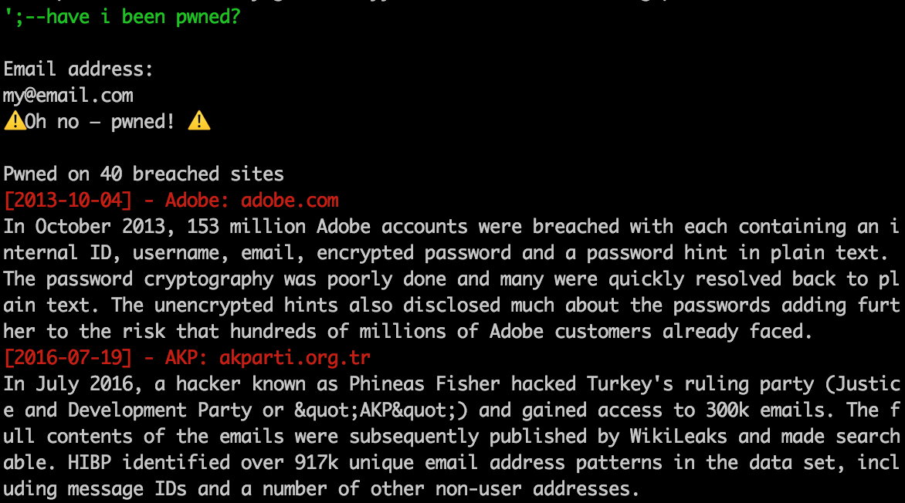

# ';--have i been pwned?

A small test with command line app. Check if you have an account that has been compromised in a data breach ;)

# Build & Run
`xcodebuild -project pwned.xcodeproj -alltargets -configuration Release`

`./build/Release/pwned`

